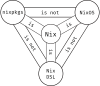

+++
date = '2025-10-03'
title = 'Building my website with Hugo and Nix'
tags = ['Nix']
+++

## Why even do this?
I recently started getting into [Nix](https://nix.dev/) and [NixOS](https://nixos.org/). So of course, now I want to use it for everything.
That's a normal thing to do when getting into new things, right?

I also have been running a small personal site on my home server that was basically just a custom-built Linktree backed by a little server written in Go.
That was cool and all, but I didn't really want to self-host it anymore. I also didn't like having to maintain the server application to be honest.
Creating a static website that looks nice is a solved problem these days I thought. Because I really just want a normal website that links to my other socials,
I decided to use [Hugo](https://gohugo.io/) for this. On top of that, I can write some blog type things (the first one of which you're reading now), which is a cool bonus. 
For hosting, I wanted to try out GitHub Pages instead of letting random strangers access my own hardware that's sitting in my apartment.

So throwing it all together, my plan was to generate a website with Hugo and Nix and upload it to GitHub Pages. Sounds simple enough, doesn't it?

## What is Nix?
From my understanding so far, Nix is a package manager based on the purely functional Nix language. You use that language to define how to
build your packages using pure functions, meaning for the same input you always get the same output. This is great for package management, because your source code
and any dependencies are the inputs and your result is the output. When you run the build, Nix evaluates your package definition,
creates a temporary environment that contains all the dependencies you specified and runs whatever command you specified. This way, whatever else you have on your system
shouldn't impact the build and you always get the same output no matter on which system you run the build on. This makes the builds completely reproducible.

Then there's also nixpkgs, which basically contains the package definitions for all sorts of programs and tools. Think of it like the Nix equivalent of APT sources on Debian/Ubuntu.

For a lot of common programming languages, nixpkgs also already has special builder functions that do a lot of the heavy lifting for you. For example, there's already
a `buildGoModule` function for building Go applications that handles everything, like installing the dependencies in your `go.mod`, for you. This function in particular will become 
relevant later, as I used it for "inspiration" for my own build.

Not exactly relevant to this, but lastly there's also NixOS, a Linux distribution that uses Nix as its package manager. It allows you to define the configuration of your entire system
using the Nix language, which I think is pretty neato. The only reason I bring this up is so I can show you the image below. It's like the holy trinity, but for Nix nerds.



## Setting up the repository
The first thing I did was to create a Nix flake for my project. Flakes are just Nix files, but they can reference other flakes hosted elsewhere as inputs (e.g. on GitHub).
The basic structure of a flake looks like this:

```nix
{
  # Inputs point to other flakes
  inputs = {
    # Use the nixpkgs flake for programs/tools
    nixpkgs.url = "github:NixOS/nixpkgs/nixos-unstable";
  };

  # The output of the flake
  outputs = {
    self,
    nixpkgs,
    ...
  }: {
    # Configuration happens here
  };
}
```


One other thing
I like about Nix is that you can create development shells. Basically, you can define all your development dependencies in your flake and when you enter your project directory
it sets up all the tools you need automatically without having to install them globally. So for my purposes, I want to install Hugo and Go.

```nix
{
  inputs = {
    nixpkgs.url = "github:NixOS/nixpkgs/nixos-unstable";
  };

  outputs = {
    self,
    nixpkgs,
    ...
  }: let
    # All the systems supported by nixpkgs (e.g. x86_64-linux, aarch64-linux, ...)
    allSystems = builtins.attrNames nixpkgs.legacyPackages;

    # Little helper function for creating configs for each system.
    # Takes a function that accepts the system's packages and returns the config for that system
    forAllSystems = (f:
      nixpkgs.lib.genAttrs allSystems (system:
        f nixpkgs.legacyPackages.${system}
      )
    );
  in {
    devShells = forAllSystems (pkgs: {
      # mkShell creates a development shell
      default = pkgs.mkShell {
        # Install the necessary Hugo and Go inside the shell
        packages = with pkgs; [
          hugo
          go
        ];
      };
    });
  };
}
```

You can then enter the shell with
```sh
nix develop
```


## Setting up Hugo

The first step for me was checking out the available themes and picking one out that I liked. I decided to use the [Congo](https://github.com/jpanther/congo) theme for now.
In case you want to know how to install it, there's a guide on the website [here](https://jpanther.github.io/congo/docs/installation/#installation). Doing that is straight-forward,
so I don't think I need to explain every step here. The important thing is that I used Hugo modules to install it. That means it's not installed inside of the repository directly,
but will instead be downloaded when building the site if it doesn't exist in the module cache already.

## Nix Build, first attempt

So now I wanted to build the thing. nixpkgs comes with a function for creating a derivation (the Nix data type for a package definition) called `stdenv.mkDerivation`. You pass in where your
source code lives, the dependencies for the build, some metadata like name and version and then also the commands needed to run the build. So I thought, I'll just do this:

```nix
{
  inputs = {
    nixpkgs.url = "github:NixOS/nixpkgs/nixos-unstable";
  };

  outputs = {
    self,
    nixpkgs,
    ...
  }: let
    # ...
  in {
    devShells = {
      # ...
    };

    packages = forAllSystems (pkgs: {
      default = pkgs.stdenv.mkDerivation {
          name = "sunnjek.github.io";
          version = self.rev or self.dirtyRev;

          src = self;

          nativeBuildInputs = with pkgs; [
            gitMinimal
            go
            hugo
          ];

          # Build the site
          buildPhase = ''
            hugo build --minify -d public
          '';

          # Copy the result into the output directory
          installPhase = ''
            cp -r --reflink=auto public $out
          '';
        };
    });
  };
}
```

Now creating the site should be as simple as running `nix build`. But that doesn't work:

```txt
> go: github.com/jpanther/congo/v2@v2.12.2: reading github.com/jpanther/congo/go.mod at revision v2.12.2: git ls-remote -q https://github.com/jpanther/congo in /build/hugo_cache/modules/filecache/modules/pkg/mod/cache/vcs/066af87f3ece5bb7d6b6b53ce98f8b34566e9be8285986a3e33bbfe82661fac4: exit status 128:
>   fatal: unable to access 'https://github.com/jpanther/congo/': Could not resolve host: github.com
> Total in 6 ms
> Error: failed to load modules: failed to download modules: failed to execute 'go [mod download]': failed to execute binary "go" with args [mod download]: go: github.com/jpanther/congo/v2@v2.12.2: reading github.com/jpanther/congo/go.mod at revision v2.12.2: git ls-remote -q https://github.com/jpanther/congo in /build/hugo_cache/modules/filecache/modules/pkg/mod/cache/vcs/066af87f3ece5bb7d6b6b53ce98f8b34566e9be8285986a3e33bbfe82661fac4: exit status 128:
>         fatal: unable to access 'https://github.com/jpanther/congo/': Could not resolve host: github.com
>  *errors.errorString
```

"Could not resolve host"? What's going on there? I can access GitHub just fine in my browser.

## Understanding how Go builds work in Nix

Remember when I said that Nix builds are (in theory) perfectly reproducible because they run inside their own
little sandbox that only gets access to the dependencies you specified? That also means that by default, they also don't get to access the internet.
If you could just download stuff from a URL, whoever runs the server could just change what gets returned from that URL. Can't have that when you want reproducible builds.

Now remember when I said I used Hugo modules to install the theme I wanted to use, which means that it doesn't live in my repository and instead gets downloaded during build time? Yeah, that's a bit of
a problem isn't it?

But do you also remember when I said there's a function for building Go projects called `buildGoModule` already? Go modules are also downloaded from the internet. In fact, Hugo modules are just Go modules. That's
why you have `go.mod`/`go.sum` in your repository when you use them. If you can't access the internet during a build, how does it work for `buildGoModule`?

Luckily, nixpkgs literally contains the Nix code for it, so I can check out how they do it. [It's right here.](https://github.com/NixOS/nixpkgs/blob/228ba700480f031a19b3f0923a6669e79716a0fa/pkgs/build-support/go/module.nix)
Now, that's a lot of complicated Nix code, so I spent way too long trying to figure this out. The interesting part starts [here](https://github.com/NixOS/nixpkgs/blob/228ba700480f031a19b3f0923a6669e79716a0fa/pkgs/build-support/go/module.nix#L80):

```nix
# ...

goModules =
  if (finalAttrs.vendorHash == null) then
    ""
  else
    (stdenv.mkDerivation {
      # ...
    });

# ...
```

The modules are their own derivation that execute `go mod download` in its build phase. Okay, but still, how do they access the internet? At this point I remembered that when you use `buildGoModule`, you also have to
pass in a `vendorHash`. That is a hash of your dependencies. This gets passed into the `mkDerivation` of the modules as `outputHash`.
The [Nix language documentation](https://nix.dev/manual/nix/2.24/language/advanced-attributes.html?highlight=outputhash#adv-attr-outputHashAlgo) has this to say about `outputHash`:

> These attributes declare that the derivation is a so-called fixed-output derivation (FOD), which means that a cryptographic hash of the output is already known in advance.
\
  As opposed to regular derivations, <ins>the builder executable of a fixed-output derivation has access to the network.</ins> Nix computes a cryptographic hash of its output and compares that to the hash declared with these attributes. If there is a mismatch, the derivation fails.

Turns out, if you can provide a hash of the expected output, Nix can verify that the output is always the same. So if someone was to tamper with the content at whatever URL you're downloading it from,
the derivation would throw an error.
And because you don't want to change the hash every time you change your source code, just when the dependencies change, `buildGoModule` creates a separate derivation for them so that only the dependencies need to get verified.

Further down they copy the downloaded modules into the output directory

```nix
installPhase = ''
  ...

  cp -r --reflink=auto "$GOPATH/pkg/mod/cache/download" $out
'';
```

and in the build they use the location of the derivation result as the `GOPROXY` when building the application so that `go build` will get the modules from there and not from the internet (which it doesn't have access to).

```nix
configurePhase = ''
  ...

  export GOPROXY="file://$goModules"
'';
```

## Nix build, second attempt

So now that I knew how I could access the internet in my build, it was time to adapt my flake. First, I need the derivation that will download the modules:

```nix
modules = pkgs.stdenv.mkDerivation {
  name = "sunnjek.github.io-modules";
  src = self;

  nativeBuildInputs = with pkgs; [
    gitMinimal
    cacert
    hugo
    go
  ];

  # Hugo caches the modules at $HUGO_CACHEDIR, so set it to a path inside the temporary build environment
  configurePhase = ''
    export HUGO_CACHEDIR=$TMPDIR/hugo-cache
  '';

  # Download the modules
  buildPhase = ''
    hugo mod get
  '';

  # Copy the downloaded modules to the output directory
  installPhase = ''
    cp -r --reflink=auto $HUGO_CACHEDIR/modules/filecache/modules/pkg/mod/cache/download $out
  '';

  dontFixup = true;

  # Specify the output hash so I can access the internet ^^
  outputHashMode = "recursive";
  outputHashAlgo = "sha256";
  outputHash = "sha256-0eJnYjEKl/nwayo902a6JApINDqfW38x0r4SyDXGlK8=";
};
```

Now when building the site I can use the same trick with the proxy that the `buildGoModule` function uses:

```nix
packages = forAllSystems (pkgs: {
  default = pkgs.stdenv.mkDerivation {
    name = "sunnjek.github.io";
    version = self.rev or self.dirtyRev;

    src = self;

    # See code above
    modules = ...;

    nativeBuildInputs = with pkgs; [
      gitMinimal
      go
      hugo
    ];

    # Use the result of the modules derivation as the proxy
    configurePhase = ''
      export HUGO_MODULE_PROXY="file://$modules"
    '';

    # Build the site
    buildPhase = ''
      hugo build --minify -d public
    '';

    # Copy the result to the output directory
    installPhase = ''
      cp -r --reflink=auto public $out
    '';
  };
});
```

And if I now run `nix build`, everything works \o/

My final site is in the `result` directory, which I can now publish.
The full `flake.nix` can be found [here](https://github.com/SuNNjek/sunnjek.github.io/blob/e183cd670d307be54c36f40b461d8f5db2858d1a/flake.nix) if you want to check it out.

## Wrapping it all up

At the end, I just use GitHub Actions to run the build and publish the site. But this is pretty boring because everything just worked here and it's the same as everyone else's setup 😅
The workflows are in the repository I linked above if you want to check it out though.

I know I could probably just have used GitHub Actions for everything. There's probably even an action that sets up Hugo for you so you just have to run the build command.
But you know, where's the fun in that? I bet that build wouldn't even be reproducible. Which probably wouldn't really matter at the end of the day anyway.
Sometimes you just have to do something just because you want to prove to yourself that it can be done, I think. And sometimes you even learn something along the way.
